# Fiat Doblò Cargo Maxi — 3D-модель фургона (WebGL)

Интерактивная модель цельнометаллического фургона Fiat Doblò Cargo Maxi (кузов 263, L2H1) на three.js: глухой грузовой отсек без окон, перегородка с окном за кабиной и кабина с интерьером. Можно вращать машину, открывать все двери и капот, заглядывать внутрь и ходить по салону от первого лица. Интерфейс рассчитан и на ПК, и на телефон.

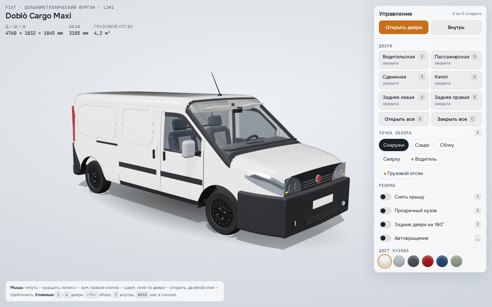

## Запуск

Модулям ES нужен HTTP-сервер, файл напрямую с диска не откроется:

```bash
npx http-server -p 8080 .
# или
python3 -m http.server 8080
```

Затем откройте http://localhost:8080. three.js лежит в `lib/`, поэтому страница работает без CDN (из интернета подгружаются только шрифты, без них всё тоже работает). Подойдёт и GitHub Pages.

## Что есть в модели

- **Кузов** собран из параметрических панелей по реальным габаритам: 4740 × 1832 × 1845 мм, база 3105 мм. Кузов полый, поэтому салон видно через стёкла и проёмы.
- **Двери:** две передние распашные, одна глухая сдвижная справа (сначала отходит наружу, потом едет назад по направляющей), глухие задние распашные с открытием на 90° или 180° (левая створка шире, на ней номер и ручка), капот. Слева глухая боковина с лючком бензобака.
- **Внешность по фото реальной машины:** большая выштамповка на боковинах, чёрные молдинги на дверях, чёрный передний бампер с противотуманками, чёрные угловые накладки сзади, чёрные стальные диски без колпаков, антенна на крыше.
- **Кабина:** торпедо с двумя большими и двумя малыми циферблатами, овальная центральная консоль с вертикальными дефлекторами, магнитолой и тремя ручками климата, руль с крупной подушкой, КПП, ручник, два сиденья с светлыми вставками и подлокотником, полка над лобовым стеклом, перегородка за кабиной с окном, обитая серым войлоком.
- **Грузовой отсек:** пустой, без обшивки: окрашенный металл стен и крыши, усилители каркаса, резиновый пол с рифлением, проушины для крепления груза, кожухи колёсных арок, плафон.
- **Режимы:** снять крышу, прозрачный кузов, 6 цветов кузова, автовращение.

## Управление

| Действие | Мышь / клавиатура | Сенсорный экран |
|---|---|---|
| Вращать | тянуть ЛКМ, `← ↑ ↓ →` или `WASD` | один палец |
| Зум | колесо, `+` / `−` | щипок |
| Сдвиг | ПКМ | два пальца |
| Открыть/закрыть дверь | клик по двери или `1`–`6` | тап по двери |
| Все двери | `O` открыть, `C` закрыть | кнопка «Открыть двери» |
| Внутрь / наружу | `I`, `Esc` | кнопки «Внутрь» / «Выйти наружу» |
| В салоне: осмотр | тянуть мышью, стрелки | один палец |
| В салоне: шаг | `WASD`, `Q`/`E` вниз/вверх | — |
| Сменить точку обзора | `V` | кнопки в панели |
| Крыша / прозрачность / 180° / вращение | `T` / `X` / `Z` / `Пробел` | переключатели в панели |
| Приблизиться к точке | двойной клик | — |

Клавиши дверей: `1` водительская, `2` пассажирская, `3` сдвижная (справа), `4` задняя левая, `5` задняя правая, `6` капот.

На телефоне панель управления сворачивается в нижнюю шторку; камера сама отъезжает так, чтобы машина целиком помещалась на экране.

## Скриншоты

| | |
|---|---|
| 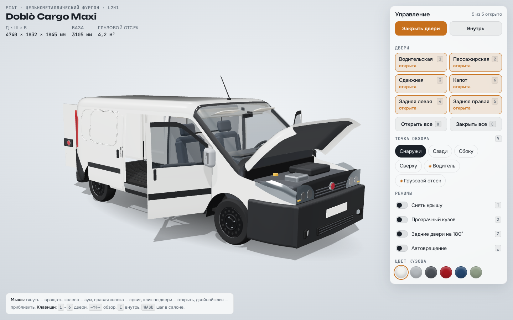 | 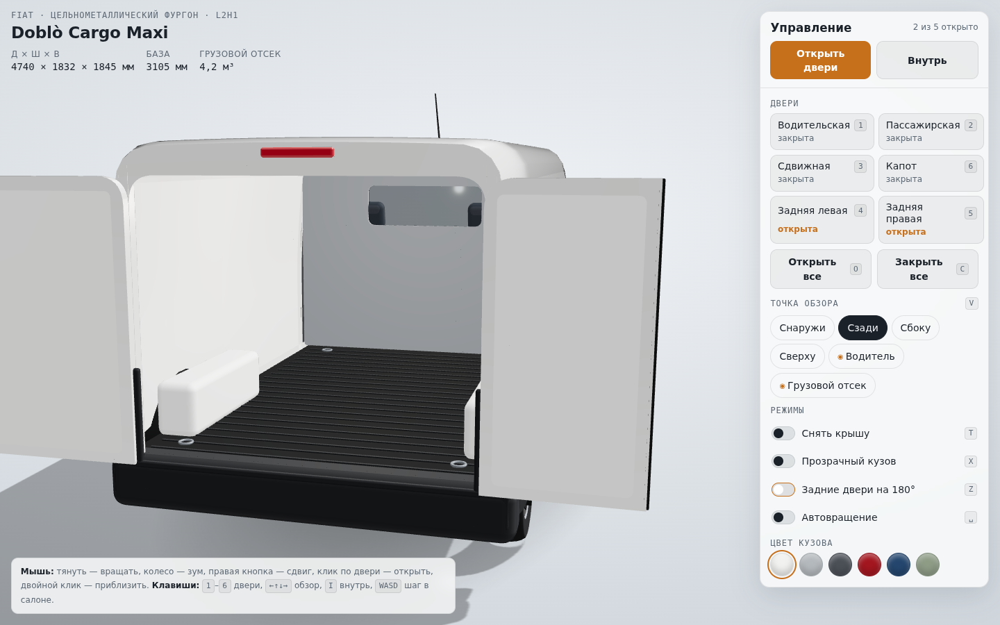 |
| 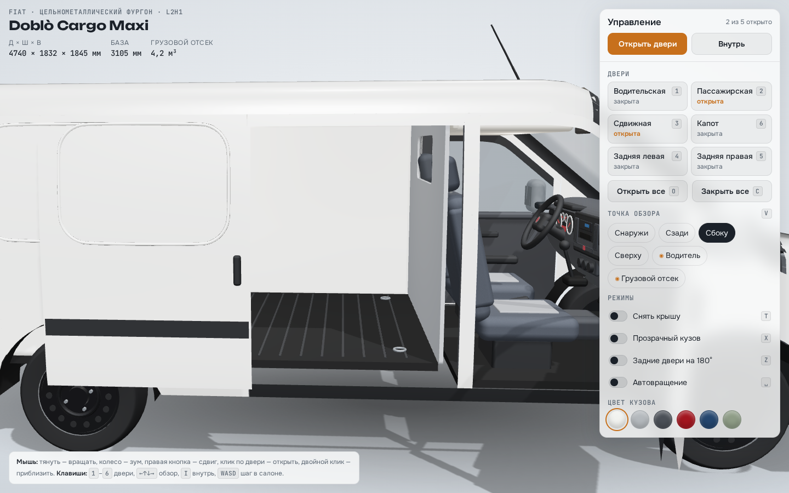 | 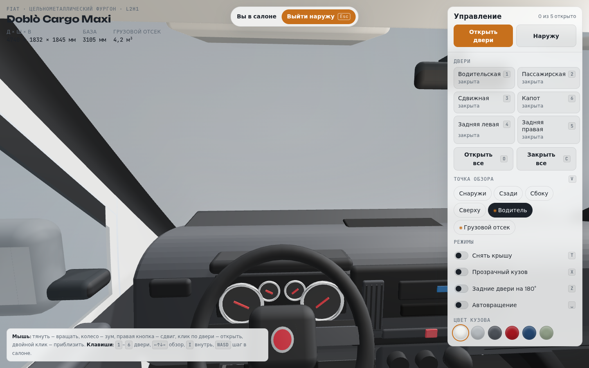 |
| 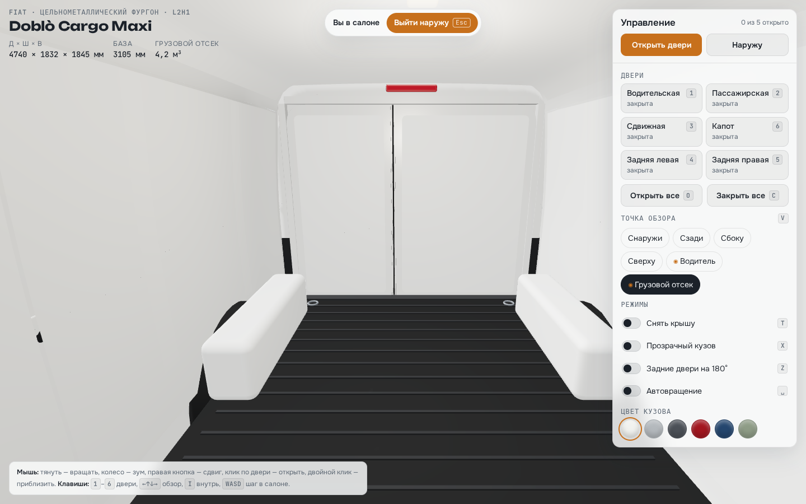 | 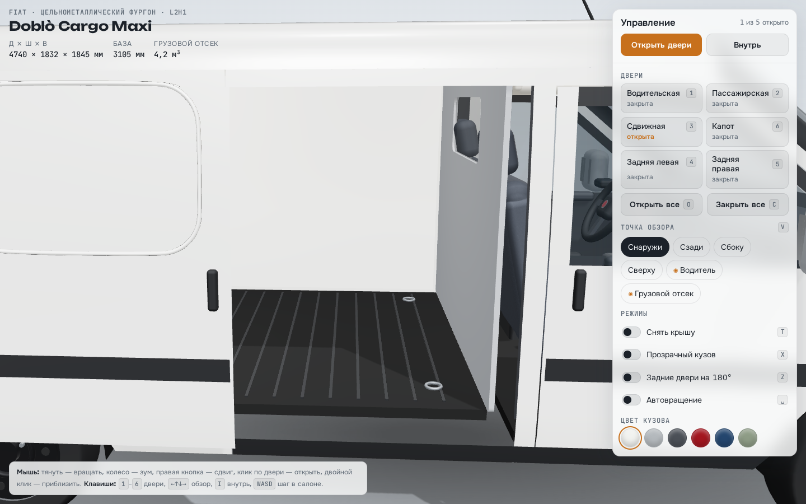 |
| 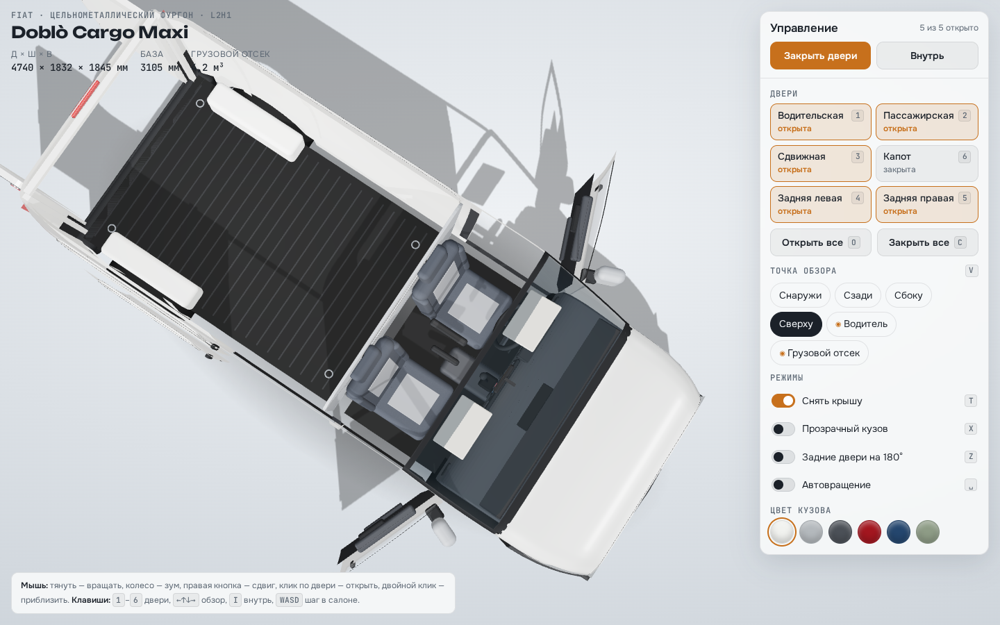 | 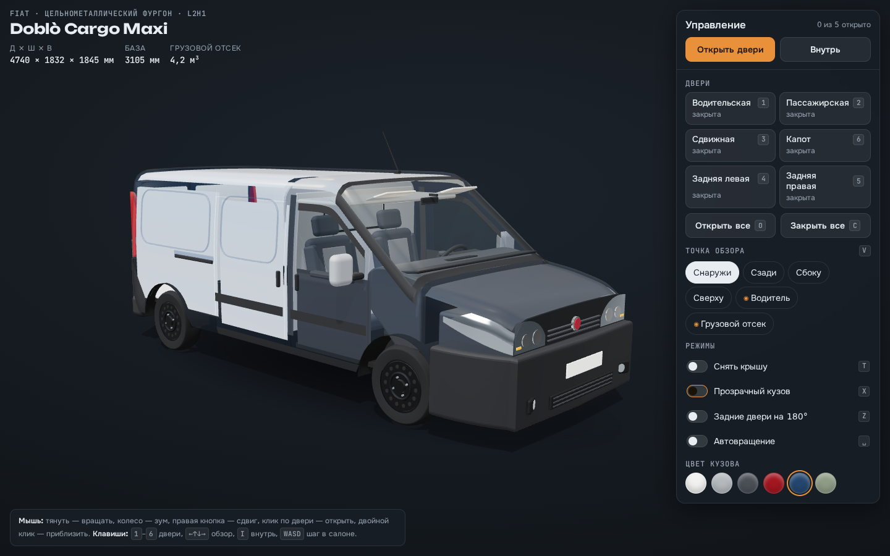 |

Телефон:

<p>
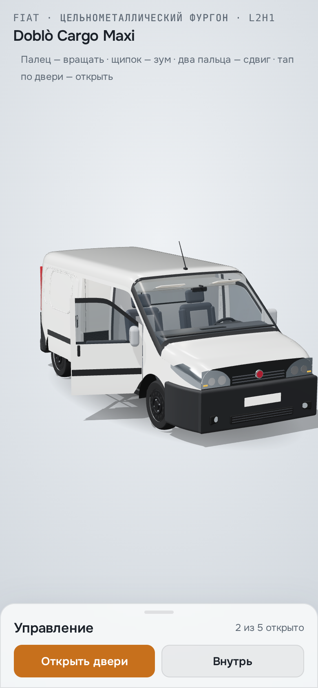
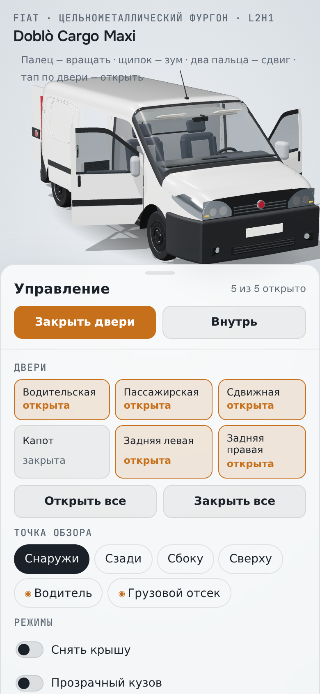
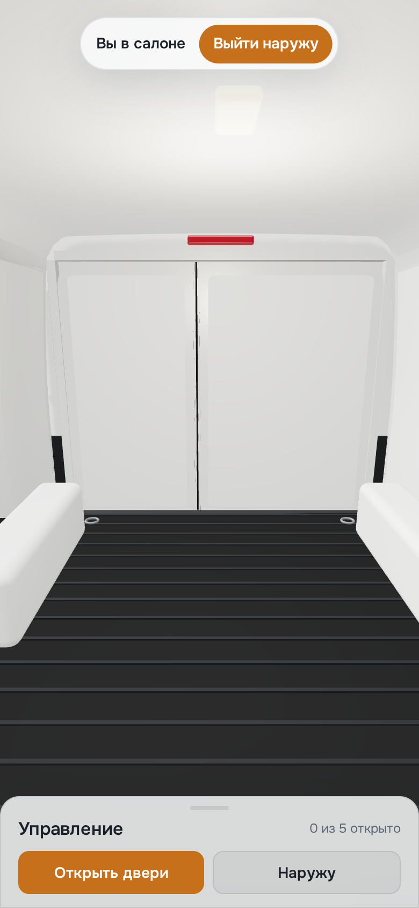
</p>

## Структура

```
index.html        разметка интерфейса
css/style.css     оформление, светлая и тёмная темы, мобильная шторка
js/car.js         процедурная модель: кузов, двери, кабина, грузовой отсек
js/main.js        сцена, камера, осмотр изнутри, двери, клавиатура и сенсор
lib/              three.js r169 и нужные дополнения (лицензия MIT)
```

Из консоли браузера моделью можно управлять через `window.doblo`, например `doblo.goView('rear')` или `doblo.setAll(true)`.
