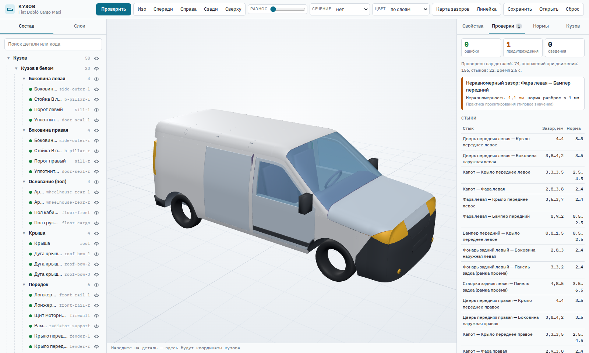
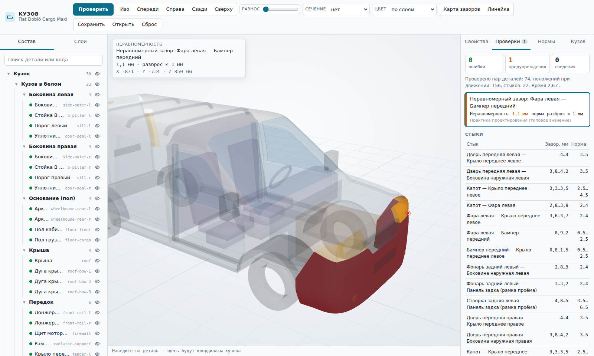
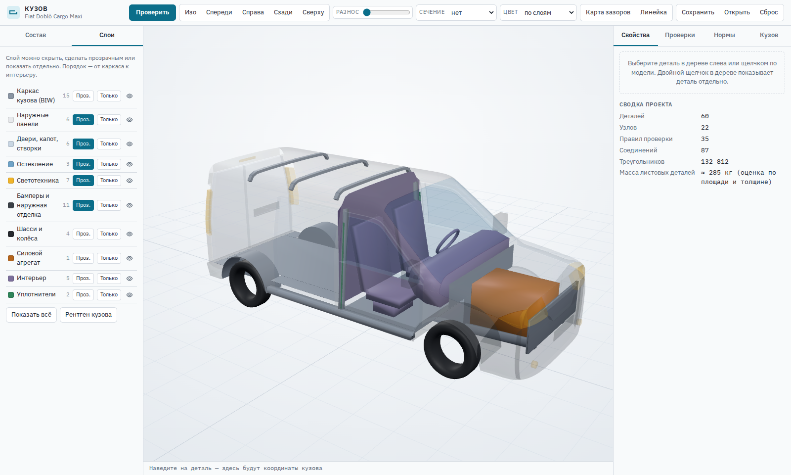
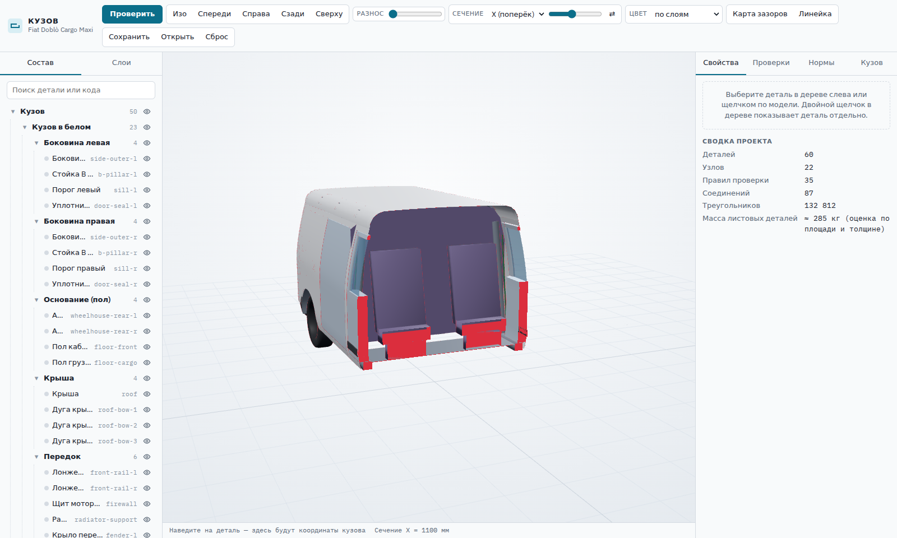
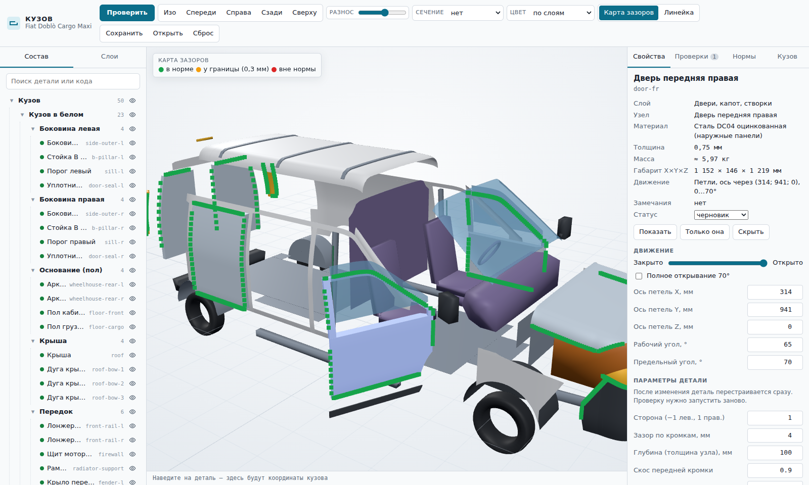
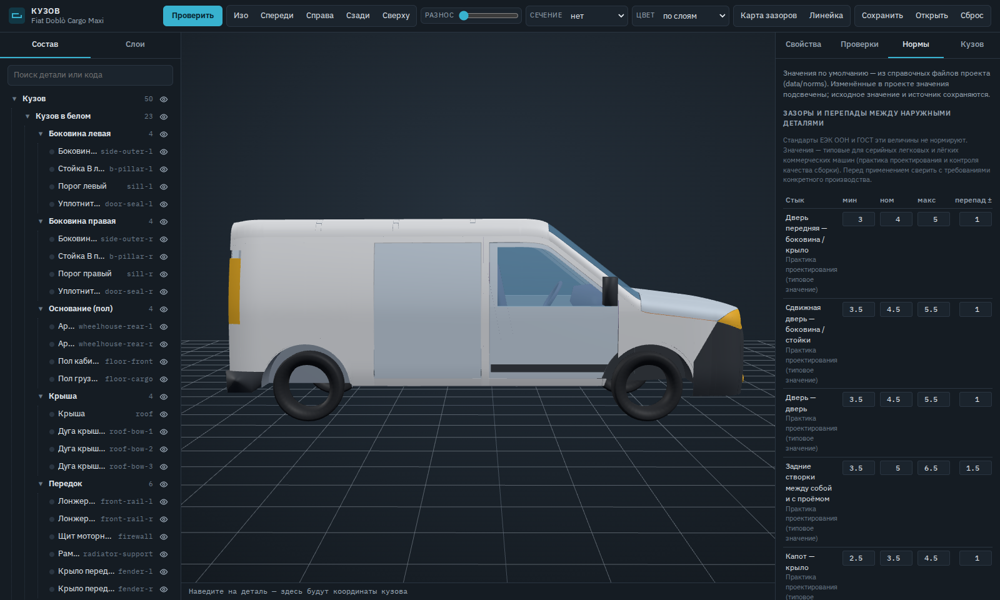
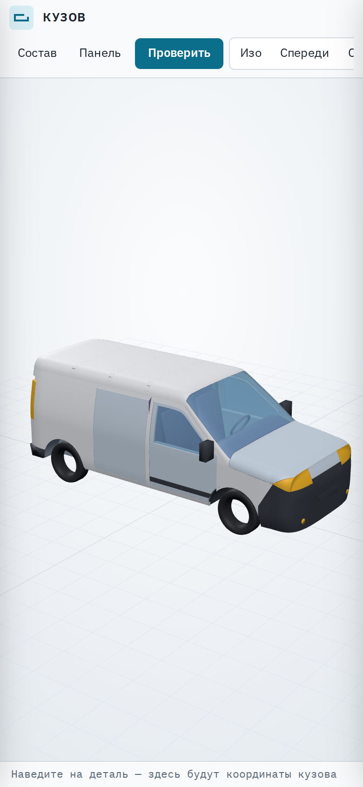
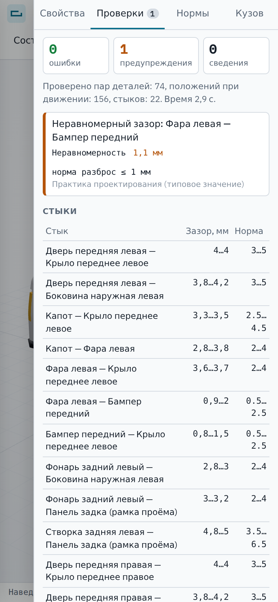

# Кузов Doblò Cargo Maxi — система проектирования

Веб-система для работы с проектом кузова. Кузов собран из отдельных деталей со своими данными. Их можно смотреть по слоям и узлам, а система проверяет:

- **коллизии** — детали пересекаются;
- **недостаточные зазоры** — детали ближе нормы, в том числе при открывании дверей и ходе колёс;
- **увеличенные зазоры** — щель шире нормы;
- **перепады и неравномерность** зазора вдоль стыков;
- **нормативы положения** — светотехника и место под номер по Правилам ЕЭК ООН.

Нормы по умолчанию взяты из справочных данных (`data/norms`), у каждой указан источник. В проекте их можно переопределить.

Пример проекта — цельнометаллический фургон Fiat Doblò Cargo Maxi (кузов 263, L2H1): 60 деталей, 22 узла, 10 слоёв, 35 правил проверки.



## Запуск

```bash
npm ci
npm run dev        # разработка: http://localhost:5173
npm test           # тесты движка проверок и проекта
npm run build      # статический сайт в dist/ (можно выложить на GitHub Pages)
npm run preview    # просмотр собранной версии
```

## Что умеет

**Состав и слои.**
- Дерево «изделие → узел → деталь»: поиск, статус проверки у каждой детали, скрытие и изоляция.
- 10 слоёв: каркас кузова (BIW), наружные панели, навесные детали, остекление, светотехника, бамперы и отделка, шасси, силовой агрегат, интерьер, уплотнители. Любой слой можно скрыть, сделать прозрачным или показать отдельно.

**Просмотр.**
- Стандартные виды, разнесённый вид, сечения по X/Y/Z с заливкой среза, линейка, координаты точки в системе кузова.
- Раскраска по слоям, материалу, толщине листа или по результату проверки.

**Свойства детали.**
- Показываются код, материал, толщина, оценка массы, габарит и описание движения.
- Параметры детали редактируются (зазоры, глубины, положения), деталь сразу перестраивается.
- У дверей, капота и створок редактируются ось петель и углы открывания. Ползунком можно открыть деталь.

**Проверки** считаются в фоновом потоке, полный прогон около 3 с.
- Сводка по серьёзности и список замечаний. По клику камера подлетает к месту, детали подсвечиваются, подвижная деталь встаёт в положение, где найдено замечание.
- Таблица стыков с фактическим диапазоном зазора и нормой.
- Карта зазоров — точки вдоль стыков: зелёные в норме, жёлтые у границы, красные вне нормы.
- Выгрузка отчёта в CSV.

**Нормы.** Таблицы зазоров и перепадов, минимальных зазоров, нормативов и материалов. Изменённые в проекте значения подсвечены, исходное значение и источник сохраняются.

**Кузов.** Габариты и базовые точки: проёмы дверей, линии остекления, стык лобового стекла. Все детали строятся от них.

**Проект** автоматически сохраняется в браузере. Его можно скачать в JSON и открыть обратно.

**Клавиши:**
- `Ctrl+Enter` — проверить;
- `1`–`5` — виды;
- `E` — разнесение;
- `M` — линейка;
- `H` — скрыть выбранную деталь;
- `I` — изолировать выбранную деталь;
- `F` — показать выбранную деталь;
- `Esc` — сбросить выбор и изоляцию.

На телефоне состав и панель открываются кнопками «Состав» и «Панель».

| | |
|---|---|
|  |  |
|  |  |
|  |   |

## Как устроены проверки

Каждая деталь — замкнутая сетка в системе координат кузова: X назад от передней оси, Y вправо, Z вверх от дороги, миллиметры. Для каждой детали строится BVH (`three-mesh-bvh`).

1. **Коллизии и касания.** Проверяются все пары, кроме конструктивно соединённых (сварка, болты, клей — список `joined` в проекте). Отбор пар идёт по габаритам. Каждое найденное пересечение перепроверяется точными запросами «точка — сетка»: проверка пересечения треугольников в `three-mesh-bvh` даёт ложные срабатывания на треугольниках в одной плоскости.
2. **Зазоры и перепады по стыкам.** Для каждого правила стыка точки наружной кромки детали A ищут ближайшую точку детали B. Зазор — расстояние между ними. Перепад — смещение по средней нормали поверхностей; считается только там, где поверхности у стыка параллельны. Точки на углах кромки и внутренние швы детали отбрасываются. Оценка идёт по всем точкам стыка: минимум, максимум, разброс.
3. **Минимальные зазоры** между заданными парами: двигатель — капот, сиденье — перегородка.
4. **Движение.**
   - Двери и капот прогоняются по углу на петлях с шагом около 4°, задние створки — до 180°.
   - Сдвижная дверь проверяется на отводе наружу и сдвиге назад.
   - Колёса проверяются на полной огибающей: поворот ±35° × ход подвески от −80 до +70 мм.
   - В замечании указывается положение, в котором найдено нарушение.
5. **Нормативы.** Высоты и положение светотехники (ЕЭК ООН № 48), место под номер (ГОСТ Р 50577-2018).

Тесты (`tests/`) проверяют движок на эталонных фигурах с известным зазором. Кроме того, в проект по очереди вносятся намеренные дефекты, и каждый из них должен быть пойман:
- зазор двери 7 мм;
- ось петель внутри кузова;
- сиденье, сдвинутое к перегородке;
- фонарь выше нормы.

## Нормы и их источники

- `data/norms/gaps.json` — зазоры и перепады наружных деталей. Стандарты их не нормируют, это практика проектирования (типовые значения).
- `data/norms/clearances.json` — минимальные зазоры: шина — арка 15 мм, подвижная панель — 3 мм, агрегаты — капот 60 мм (для выполнения ЕЭК ООН № 127).
- `data/norms/regulations.json` — Правила ЕЭК ООН № 48 и ГОСТ Р 50577-2018. ТР ТС 018/2011 ссылается на Правила ЕЭК ООН.
- `data/materials.json` — марки сталей (EN 10130, EN 10346), пластики и стекло.

Перед применением сверяйте значения с действующей редакцией стандарта и требованиями конкретного производства.

## Ограничения

- **Заводской CAD-модели Fiat нет.** Геометрия построена по габаритам, чертежу Doblò 2015 Cargo LWB и фото, поэтому проверки находят конфликты внутри этой модели. Для реального изделия нужен импорт CAD-данных (в плане — этап 7: glTF и STEP).
- **Одно известное предупреждение в базовом проекте.** Разброс зазора фара — бампер в левом углу носа 1,1 мм при норме 1,0 мм. Это неточность сетки в самом сложном месте модели, система её честно показывает.
- **Масса — оценка** по площади и толщине листа.

## Структура

```
index.html               страница приложения
src/core/                модель данных проекта, кинематика
src/geometry/            управляющие поверхности кузова, построение листовых деталей с толщиной
src/parts/               генераторы деталей Doblò и проект по умолчанию (детали, узлы, соединения, правила)
src/checks/              движок проверок, нормы, фоновый поток
src/viewer/              3D-вьюер
src/app/                 интерфейс и стили
data/norms/, data/       справочные нормы и материалы
tests/                   тесты
docs/PLAN.md             план и принятые решения
```
