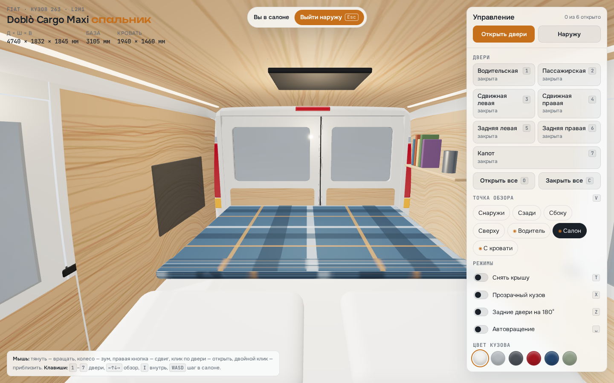
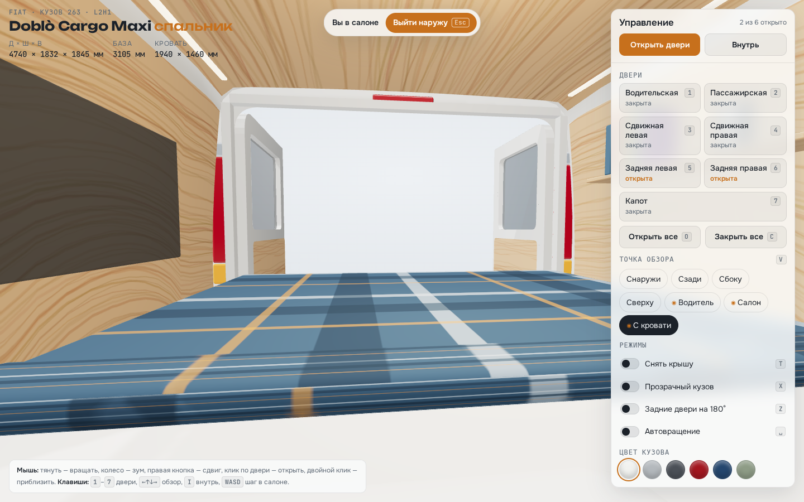

# Fiat Doblò Cargo Maxi — 3D-модель со спальником (WebGL)

Интерактивная модель Fiat Doblò Cargo Maxi (кузов 263, L2H1) на three.js: кузов, кабина и спальный модуль в грузовом отсеке. Можно вращать машину, открывать все двери и капот, заглядывать внутрь и ходить по салону от первого лица. Интерфейс рассчитан и на ПК, и на телефон.


## Запуск

Модулям ES нужен HTTP-сервер, файл напрямую с диска не откроется:

```bash
npx http-server -p 8080 .
# или
python3 -m http.server 8080
```

Затем откройте http://localhost:8080. three.js лежит в `lib/`, поэтому страница работает без CDN (из интернета подгружаются только шрифты, без них всё тоже работает). Подойдёт и GitHub Pages.

## Что есть в модели

- **Кузов** собран из параметрических панелей по реальным габаритам: 4740 × 1832 × 1845 мм, база 3105 мм. Кузов полый, поэтому салон видно через стёкла и проёмы.
- **Двери:** две передние распашные, две сдвижные (сначала отходят наружу, потом едут назад по направляющей), задние распашные 60/40 с открытием на 90° или 180°, капот.
- **Кабина:** торпедо с приборами и экраном, руль, педали, КПП, ручник, два сиденья, полка над кабиной, козырьки, салонное зеркало.
- **Спальник:** фанерная обшивка, кровать 1940 × 1460 мм с матрасом, подушками и пледом, выдвижные ящики со стороны задних дверей, полка с книгами, LED-ленты, люк-вентилятор на крыше.
- **Режимы:** снять крышу, прозрачный кузов, 6 цветов кузова, автовращение.

## Управление

| Действие | Мышь / клавиатура | Сенсорный экран |
|---|---|---|
| Вращать | тянуть ЛКМ, `← ↑ ↓ →` или `WASD` | один палец |
| Зум | колесо, `+` / `−` | щипок |
| Сдвиг | ПКМ | два пальца |
| Открыть/закрыть дверь | клик по двери или `1`–`7` | тап по двери |
| Все двери | `O` открыть, `C` закрыть | кнопка «Открыть двери» |
| Внутрь / наружу | `I`, `Esc` | кнопки «Внутрь» / «Выйти наружу» |
| В салоне: осмотр | тянуть мышью, стрелки | один палец |
| В салоне: шаг | `WASD`, `Q`/`E` вниз/вверх | — |
| Сменить точку обзора | `V` | кнопки в панели |
| Крыша / прозрачность / 180° / вращение | `T` / `X` / `Z` / `Пробел` | переключатели в панели |
| Приблизиться к точке | двойной клик | — |

Клавиши дверей: `1` водительская, `2` пассажирская, `3` сдвижная левая, `4` сдвижная правая, `5` задняя левая, `6` задняя правая, `7` капот.

На телефоне панель управления сворачивается в нижнюю шторку; камера сама отъезжает так, чтобы машина целиком помещалась на экране.

## Скриншоты

| | |
|---|---|
|  |  |
|  |  |
|  |  |
|  |  |

Телефон:

<p>


</p>

## Структура

```
index.html        разметка интерфейса
css/style.css     оформление, светлая и тёмная темы, мобильная шторка
js/car.js         процедурная модель: кузов, двери, кабина, спальник
js/main.js        сцена, камера, осмотр изнутри, двери, клавиатура и сенсор
lib/              three.js r169 и нужные дополнения (лицензия MIT)
```

Из консоли браузера моделью можно управлять через `window.doblo`, например `doblo.goView('rear')` или `doblo.setAll(true)`.
