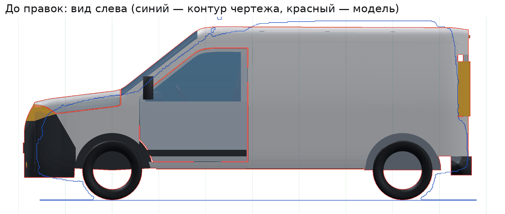
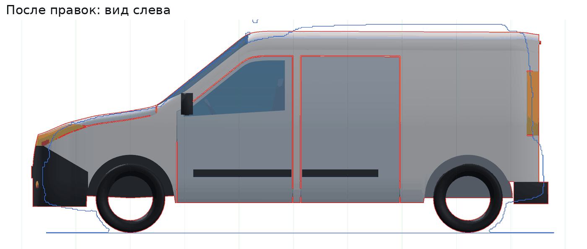
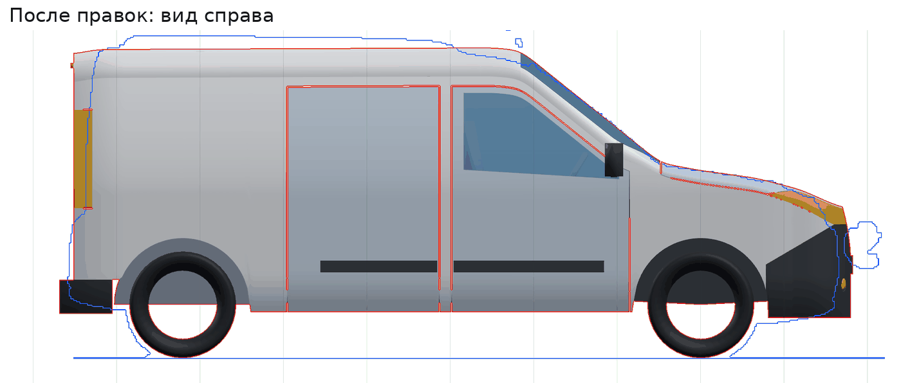
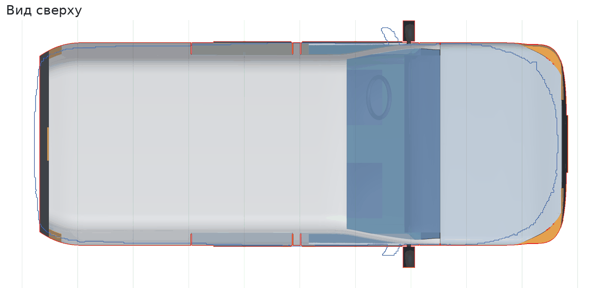
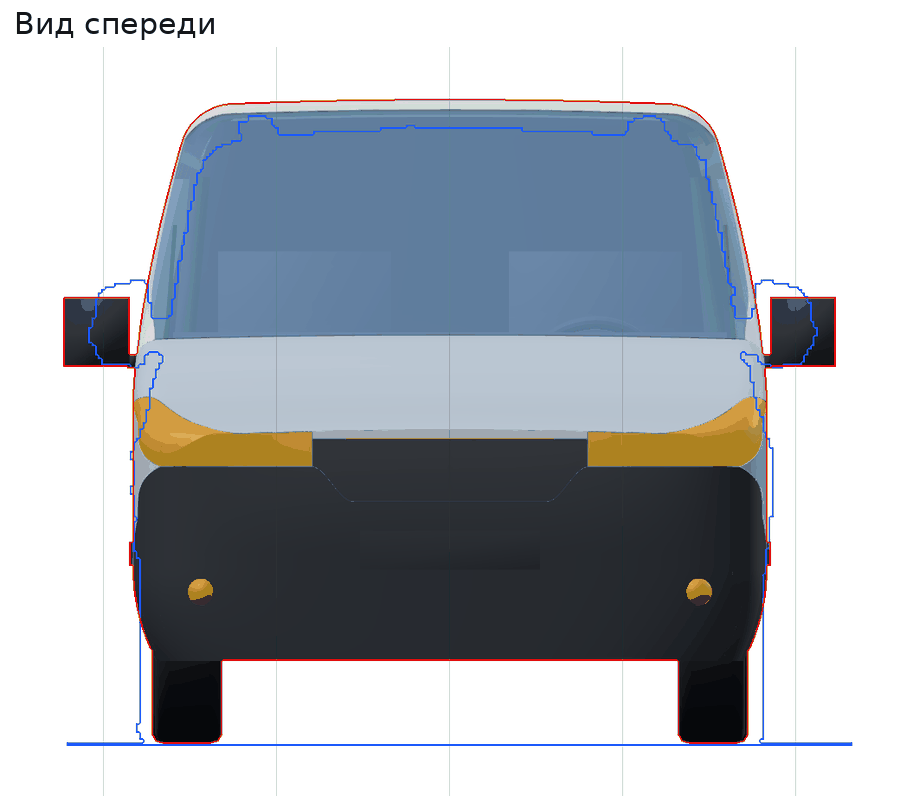
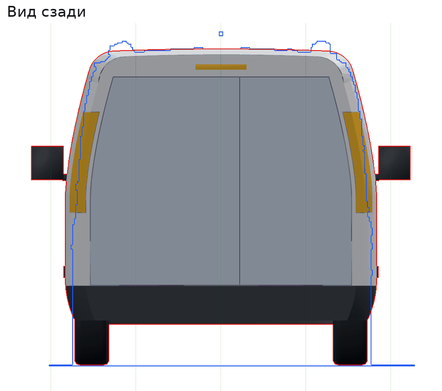

# Сверка с чертежом Fiat Doblò 2015 Cargo LWB

Геометрия проекта сверена с чертежом Doblò 2015 Cargo LWB. На чертеже пять видов, база 3105 мм и колея 1530 мм.

## Как сверяли

1. **Масштаб чертежа.** Считается по размерным линиям: база 3105 мм даёт 9,16 мм/пиксель, колея 1530 мм — то же значение. Начало координат — передняя ось и линия дороги.
2. **Снимки модели.** Вьюер делает ортогональный снимок в известном масштабе: `viewer.orthoSnapshot(вид, центр, ширина, высота, мм/пиксель)`. Каждый пиксель переводится в миллиметры системы кузова.
3. **Контур чертежа.** Силуэт выделяется заливкой фона, затем оба контура накладываются в миллиметрах. На картинках ниже синий контур — чертёж, красный — модель, сетка через 500 мм.

**Чертёж не во всём совпадает с паспортными данными.** По техническим данным Fiat Professional Doblò Cargo Maxi 2015 имеет:
- длину 4756 мм;
- базу 3105 мм;
- передний свес 911 мм, задний — 740 мм.

На чертеже в масштабе базы свесы короче: 815 и 687 мм, то есть длина 4607 мм. Виды чертежа ещё и немного расходятся между собой: вид сверху длиннее видов сбоку на 2 %, вид сзади уже вида сверху на 3 %. Поэтому общие габариты взяты из паспортных данных, а форма и положение линий — с чертежа.

## Что исправлено

| Что | Было | Стало | Основание |
|---|---|---|---|
| Габарит по бамперам | −954…3844 мм (4798 мм) | −911…3845 мм (4756 мм) | паспорт: 4756 мм, свесы 911 / 740 мм |
| Линия капота | передняя кромка ~1050 мм | ~910 мм у носа, 1115 мм над осью | вид сбоку |
| Основание лобового стекла `xCowl` | 90 мм | 240 мм | вид сбоку |
| Верх лобового стекла `xRoofFront` | 910 мм | 1080 мм | вид сбоку |
| Радиус кромок капота и крыльев | 160 мм, как у крыши | 70 мм у капота, по стойке стекла переходит в 160 мм | виды спереди и сбоку |
| Нос | вертикальный до 720 мм | скругляется назад от верха бампера (560 мм) к передней кромке капота | вид сбоку |
| Передняя кромка капота | прямая по шву носа | по центру на 50 мм впереди шва, у фар плавно уходит назад к углу носа (см. [REVIEW.md](REVIEW.md)) | виды сверху и сбоку |
| Верх решётки `zGrilleTop` | задан числом 900 в коде | базовая точка, 880 мм | вид спереди |
| Верх бампера по центру | 750 мм | 700 мм | вид спереди |
| Фара | на углу носа, до X = −600 мм | вдоль крыла до X = −400 мм | вид сбоку |
| Бампер на боковине | идёт под фарой | от угла носа косо вниз к арке, между фарой и бампером — клин крыла | вид сбоку |
| Противотуманные фары | Y ±610, Z 370 | Y ±720, Z 440 | вид спереди |
| Передний проём двери `xDoorFront` | 290 мм | 425 мм | вид сбоку |
| Стойка B / сдвижная дверь | 1450 / 1520…2490 мм | 1495 / 1565…2480 мм | виды сбоку |
| Низ дверей | порог 410 мм, под дверью видна боковина | двери до нижней кромки кузова, 275 мм; порог утоплен | вид сбоку |
| Линия остекления | 1060 мм, горизонтальная | 1070 мм у стойки A, 1135 мм у стойки B | вид сбоку |
| Зеркала | 1080…1330 мм у старого проёма | в переднем углу окна, от линии остекления | виды сбоку и спереди |
| Сдвижные двери | только правая | с обеих сторон | вид слева |
| Молдинги | 470…540 мм, только на передних дверях | 515…585 мм, на передних и сдвижных дверях | виды сбоку |
| Задние створки / бампер | плоскость створок 3810 мм, бампер выступает на 35 мм | створки 3760 мм, бампер выступает на 85 мм | вид сбоку: ступенька под створками |

**Результат.** Среднее отклонение линии капота и лобового стекла от чертежа на участке X = −600…1100 мм уменьшилось со 103 до 17 мм. Совпадение силуэта сбоку (IoU) выросло с 0,853 до 0,893.

## Что ещё нашли и исправили по ходу сверки

- **Перегородка кабины выходила за боковины.** Она торчала наружу на 48 мм в верхних углах. Проверка коллизий этого не видела: перегородка и боковина соединены конструктивно, такие пары не проверяются.
  - Перегородка теперь идёт по завалу боковин.
  - Добавлен тест: детали интерьера и агрегатов не выходят за наружную поверхность кузова.
- **Прежнее известное предупреждение ушло.** Это был разброс зазора фара — бампер в углу носа. Верх бампера теперь уходит от угла носа косо вниз, как на чертеже, и стык фара — бампер стал ровным. Базовый проект проходит все проверки без замечаний.
- **Кромка капота у фары строится точно.** Кромка фары идёт косо по скруглению крыла. Кромку капота теперь ищем так, чтобы расстояние в пространстве до кромки фары было ровно равно зазору. Раньше поправка была приближённой, и зазор гулял от 2,4 до 3,8 мм. Теперь он 3,4–3,6 мм.
- **Ось петель капота поднята к уровню его поверхности.** При открывании задняя кромка капота поднимается и не задевает стойки лобового стекла.
- **Агрегаты подстроены под новый капот.**
  - Верх двигателя идёт за профилем капота с запасом под норму 60 мм.
  - Щит моторного отсека и рамка радиатора привязаны к базовым точкам.

## Что осталось отличаться

- **Свесы.** Нос длиннее чертежа на ~95 мм, корма — на ~50 мм. Так и задумано: приняты паспортные данные, см. выше.
- **Наклон задних створок.** На чертеже они слегка наклонены вперёд, примерно на 4°. В модели створки вертикальные, а плоскость взята по середине высоты. Наклон потребует наклонной оси петель створок.
- **Рейлинги крыши.** На чертеже они есть, а у фургона на фото — нет. В проект не добавлены.
- **Колёса.** Это огибающая шины без диска: для проверок зазоров достаточно.

## Картинки

| | |
|---|---|
|  |  |
|  |  |
|  |  |

На картинках показан только контур чертежа, сам исходный рисунок в репозиторий не добавлен.
