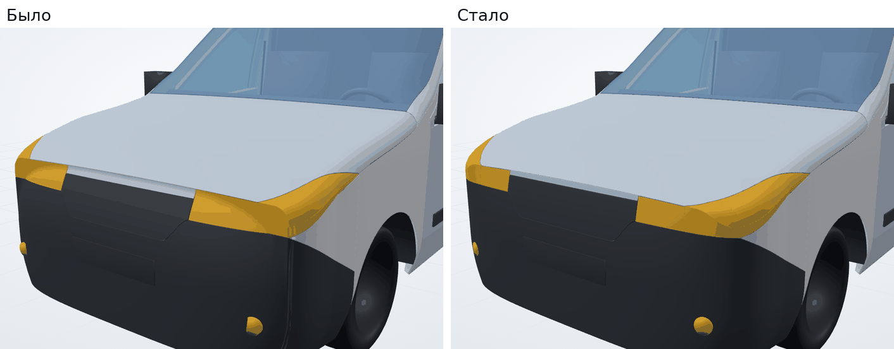
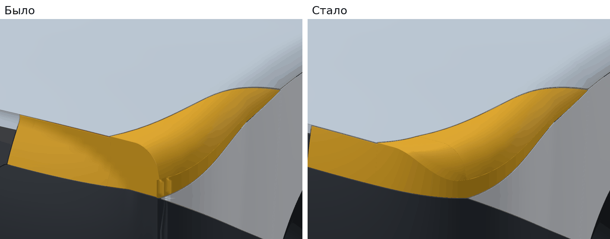
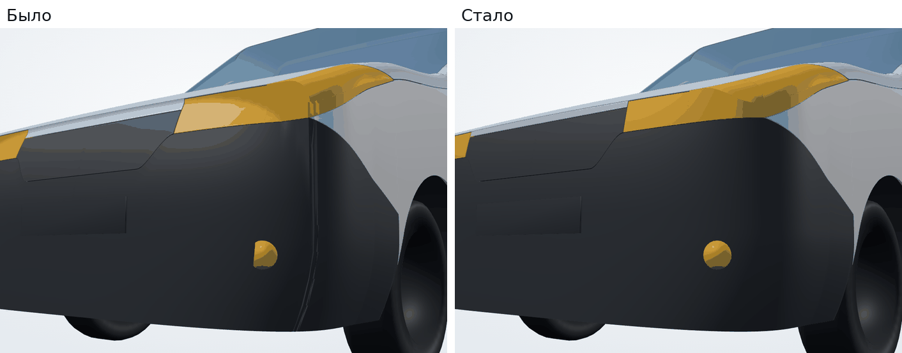
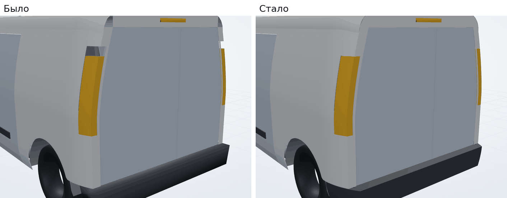
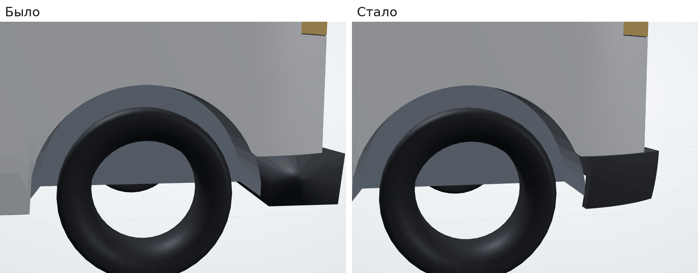

# Осмотр деталей: найдено и исправлено

После сверки с чертежом все детали кузова осмотрены крупным планом со всех сторон. Часть дефектов оказалась ошибками в геометрии, часть — пробелами в самих проверках. Ниже перечислено, что нашли и как исправили.

## Фары, капот, нос

| | |
|---|---|
|  |  |

- **Острое ребро и «язычки» на углу фары.** Капот упирался в нос по прямой линии шва, поэтому нос вверху поджимался к этой прямой. На углу между лицевой частью фары и крылом получалось ребро, а торцевые стенки отдельных кусков фары торчали наружу.
  - Передняя кромка капота теперь по центру прямая, а в зоне фар плавно уходит назад к углу носа и там касательна к крылу.
  - По высоте нос плавно переходит от формы бампера к этой кривой.
  - Лицевая часть фары и её часть на крыле — одна поверхность, огибающая угол, без шва.
- **Ошибка в нормали левой стороны кузова.** `BodyForm.sideInward` считала продольную составляющую нормали с неверным знаком для левой стороны. На сужающихся участках, у носа и у кормы, толщина левых деталей откладывалась косо, часть треугольников выворачивалась. Отсюда шли полосы и бороздки на левом углу бампера и фары.
- **Шов на углу бампера.** Лицевая и боковые части бампера теперь одна поверхность, без швов на углах носа. Сетка по высоте сгущена: длинные тонкие треугольники давали полосы при освещении.
- **Неравномерный зазор капот — фара.**
  - Кромка капота строится точно на расстоянии зазора от кромки фары в пространстве.
  - Расстояние считается до отрезков кромки, а не до её точек: с точками зазор получался меньше заданного.
  - У передней кромки капота сетка мельче.
  - Зазор по всей длине стыка 3,4–3,6 мм.
- **Противотуманные фары** стоят по нормали к бамперу и не вылезают из него наполовину.
- **Щель под кромкой капота.** Через неё был виден двигатель — рамка радиатора поднята до верха решётки.

| |
|---|
|  |

## Корма

| | |
|---|---|
|  |  |

- **Сквозная щель над задними фонарями, 73 мм.** Фонарь занимал 900–1490 мм, а вырез под него в боковине и панели задка — 897–1563 мм. Теперь вырез задан в одном месте (`BodyForm.tailCut`), а фонарь заполняет его с зазором.
- **Отверстия в верхних углах задка, 96 мм.** Поперечина над проёмом шла только на ширину проёма, а скруглённые углы крыши над стойками оставались открытыми. Теперь поперечина закрывает сечение задка на всю ширину.
- **Открытый низ за задними арками.** Задний бампер огибает угол кузова до колёсной арки, как у серийного фургона.

## Прочее

- **Дуги крыши проступали сквозь обшивку.** Скругление крыши было разбито всего на 4–5 граней, и хорды срезали обшивку ниже дуг. Сетка крыши сгущена.
- **Детали просвечивали сквозь обшивку при отрисовке.** Во вьюере включён логарифмический буфер глубины. Сцена в миллиметрах тянется от 20 мм до 60 м, а детали лежат в 1–2 мм друг от друга; с обычным буфером глубины, особенно 16-битным на телефонах, этого не хватало.

## Что добавлено в систему проверок

- **Сквозные просветы в наружной обшивке** — новая проверка.
  - Кузов просвечивается параллельными лучами с пяти сторон с шагом 12 мм. Если луч первым попадает в салон или агрегат, а на виде сбоку — в противоположный борт, значит он прошёл через отверстие.
  - Соседние такие лучи собираются в пятна. Пятно больше 25 мм — ошибка; щели стыков панелей уже.
  - Так находятся дыры, которые правила зазоров не видят: у кромки отверстия нет соседней детали в пределах поиска.
  - Норма `skin-opening` лежит в `data/norms/clearances.json`.
- **Тест согласованной ориентации сеток.** Соседние треугольники одной сетки проходят общее ребро в противоположных направлениях. Тест ловит вывернутые треугольники; на ошибке с нормалью левой стороны он падает.
- **Тест с намеренным дефектом:** без левого заднего фонаря проверка должна найти просвет на его месте.

Базовый проект проходит все проверки без замечаний. Все тесты проходят.
